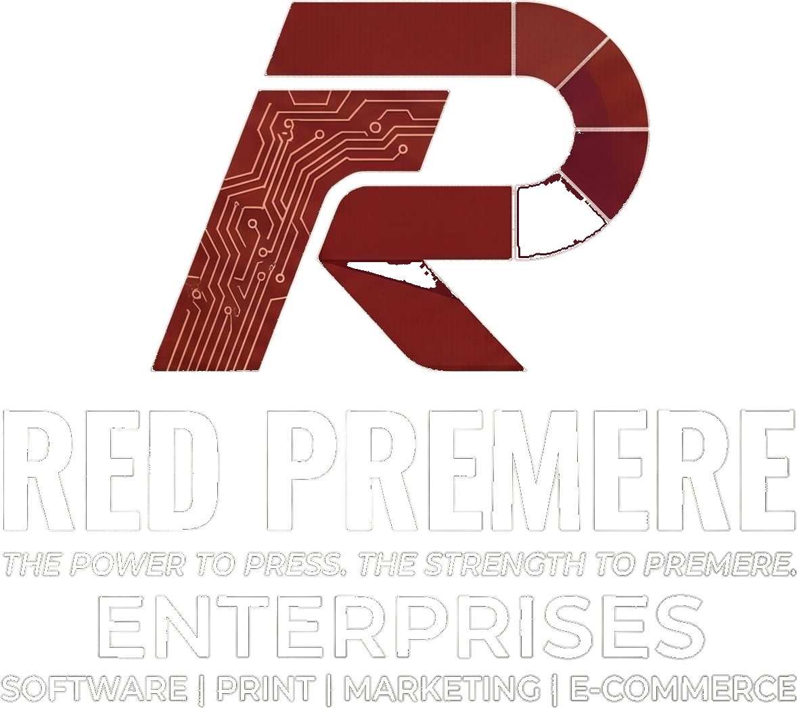

# Red Premere Enterprises — redpremere.com

**v1.3**

## v1.3 — content pass

- **about.html** rewritten. The old copy sold bottles and merch and linked out
  to Honestbro; it now describes the firm as it actually is — a proprietorship
  doing institutional supply and software. Values and "who we serve" grids
  rewritten to lead with government schools, colleges and coaching centres.
  The registration box now shows Udyam and the store instead of Honestbro.
- **services.html** — the web development block was a bare heading. It now
  carries four panels: what every site includes, institutional sites, web
  applications, and how we work.
- **portfolio.html** — the `REPLACE_WITH_TRIPLEDGER_URL` placeholder is gone
  rather than shipping a dead link. TripLedger shows "Internal deployment", with
  an HTML comment above it holding the anchor markup to paste back in if a
  public URL ever exists.
- **Project cards** — the school portal card on the home page now links to the
  live GGIC demo, matching the portfolio page.
- **Image slots** — each empty slot renders a dashed frame naming the file it
  wants (`assets/img/supply.jpg` and so on) instead of collapsing silently.
  See `assets/img/README.txt`.

**v1.2**

## v1.2 — "Ink & Brass" theme, website-only pricing

**Theme.** Red-on-black replaced with a deep ink-navy ground, an antique-brass
accent and a verdigris secondary. Display type is Spectral (serif, sentence
case) instead of Anton (heavy condensed caps); eyebrows, prices, tags and stats
are IBM Plex Mono so figures read like a quotation sheet. The old CSS variable
names (`--red`, `--gold`) are kept so nothing downstream breaks — only their
values changed. New tokens: `--rule`, `--font-display`, `--font-body`,
`--font-mono`.

**Hero.** The bottle/t-shirt/mug orbit and its floating price labels
(₹8/pc, ₹500, ₹100) are gone. In their place is a "What we supply" panel — a
five-row quotation sheet ending in the process line.

**Pricing.** Merchandise pricing is removed site-wide. Only websites carry
prices now: Starter ₹5,999, Business ₹9,999, custom web app quoted. Annual
renewal ₹2,000. The "Individual Product Pricing" grid (bottles, t-shirts, caps,
mugs) and the bottle-subscription loyalty tiers are deleted. The contact form's
package dropdown was rebuilt to match.

**Portfolio.** TripLedger and the school portal now have visit links.
TripLedger's URL is a placeholder — see below.

**Images.** `assets/img/` holds the filenames each `` expects. Every one
has an `onerror` handler, so missing files degrade quietly rather than showing
a broken-image icon.

### Two things to fill in

1. `assets/img/README.txt` lists the eight photographs the layout expects.
2. `portfolio.html` has `REPLACE_WITH_TRIPLEDGER_URL` — swap in the real URL,
   or delete that one anchor if TripLedger has no public deployment.

**v1.1**

Static website for Red Premere Enterprises, Varanasi, UP.

## v1.1 — repositioning

The site now leads with government/institutional supply and the project
portfolio. Consumer products (bottles, merchandise) moved to the store.

- **index.html** — new hero, "Government Supply" section (`#govt-supply`),
  "Projects We've Built" section, "E-Commerce Branch" section. Bottle and merch
  cards now link out to store.redpremere.com. Stats, marquee, offer strip and
  "How It Works" rewritten around supply and quotations.
- **portfolio.html** — placeholder cards removed. Four real projects with status
  badges: granixtech.in (Completed), TripLedger (Completed), Government School
  Portal (In Development), store.redpremere.com (Ongoing). Category filters now
  actually filter.
- **services.html** — three "lines of business" blocks added above the existing
  bundle pricing: Government & Institutional Supply, Websites & Web Applications,
  E-Commerce Branch.
- **about.html** — headings updated.
- **All pages** — nav and mobile nav gained a Store link; footer service list
  replaced with Government Supply / Web Development / Projects / Online Store.

Honestbro.online was removed from the portfolio as requested.

## File Structure
```
redpremere/
├── index.html        # Homepage
├── services.html     # Packages & pricing
├── about.html        # About us & founder
├── portfolio.html    # Work portfolio
├── contact.html      # Inquiry form
├── css/
│   └── style.css     # All shared styles
├── js/
│   └── main.js       # Nav, scroll, form logic
└── assets/           # Add logo here when ready
```

## Before Going Live — 2 Things to Do

### 1. Set up Formspree (free email form handler)
1. Go to https://formspree.io and create a free account
2. Create a new form → copy your Form ID (looks like `xpzgkwqr`)
3. In `contact.html`, find this line:
   ```html
   <form id="inquiryForm" action="https://formspree.io/f/YOUR_FORM_ID" method="POST">
   ```
4. Replace `YOUR_FORM_ID` with your actual Formspree ID
5. Done — form submissions will now email you at info@redpremere.com

### 2. Add your logo (optional)
- Place your logo file in `assets/logo.png`
- Replace the `.nav-logo-mark` "RP" text in each HTML file with:
  ```html
  
  ```

---

## Deploying to GitHub + Cloudflare Pages

### Step 1 — Create GitHub Repository
1. Go to https://github.com and sign in
2. Click **New repository**
3. Name: `redpremere-website`
4. Set to **Public** (required for free Cloudflare Pages)
5. Click **Create repository**

### Step 2 — Upload Files to GitHub
Option A (browser, easiest):
1. Open your new repo
2. Click **Add file → Upload files**
3. Drag all files (index.html, services.html, about.html, portfolio.html, contact.html, css/, js/) into the uploader
4. Click **Commit changes**

Option B (Git command line):
```bash
git init
git add .
git commit -m "Initial website launch"
git remote add origin https://github.com/YOUR_USERNAME/redpremere-website.git
git push -u origin main
```

### Step 3 — Connect Cloudflare Pages
1. Go to https://dash.cloudflare.com
2. Click **Workers & Pages → Create application → Pages → Connect to Git**
3. Authorize GitHub and select `redpremere-website`
4. Build settings:
   - **Framework preset:** None
   - **Build command:** (leave empty)
   - **Build output directory:** `/` (or leave empty)
5. Click **Save and Deploy**
6. Cloudflare will give you a free URL like: `redpremere-website.pages.dev`

### Step 4 — Connect redpremere.com Domain
1. In Cloudflare Pages, go to your project → **Custom domains**
2. Click **Set up a custom domain**
3. Enter: `redpremere.com`
4. Cloudflare will add the DNS record automatically (since your domain is on Cloudflare)
5. Done! redpremere.com is live ✅

### Step 5 — Auto-Deploy on Push
Every time you push changes to GitHub, Cloudflare Pages auto-rebuilds and redeploys. No manual action needed.

---

## Adding Client Subpages (e.g. redpremere.com/sharma-gym)

For clients who only want bottles with QR (no separate website):
1. Create a folder in the repo: `sharma-gym/`
2. Add an `index.html` inside it with their info
3. Push to GitHub
4. Cloudflare Pages will serve it at `redpremere.com/sharma-gym`

---

## Adding a Client With Their Own Website

For clients who want their own domain + separate website:
1. Create a new GitHub repo: `sharma-gym-website`
2. Build their static site (new HTML files)
3. Create a NEW Cloudflare Pages project connected to that repo
4. Buy their domain and connect it in Cloudflare
5. Completely separate from redpremere.com

---

## Tech Stack
- Pure HTML + CSS + Vanilla JS (zero dependencies)
- Hosted on Cloudflare Pages (free tier)
- Forms handled by Formspree (free tier = 50 submissions/month)
- Fonts: Google Fonts (Anton + Space Grotesk)

